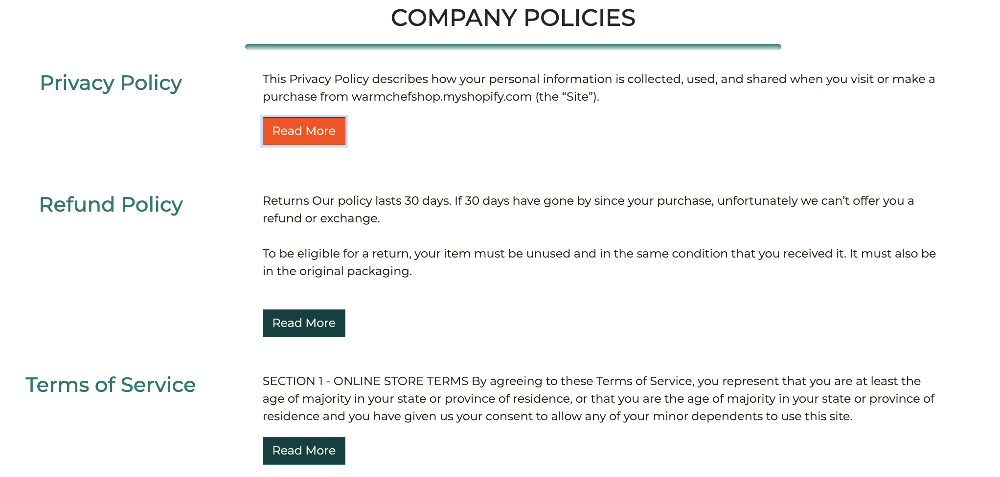
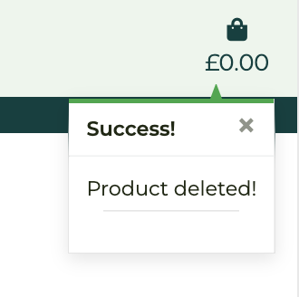

### TABLE OF CONTENTS

[Code Validation](#code-validation)

[Testing User Stories](#Testing-user-stories)

[Manual Testing](#Manual-testing)

[Further Testing](#Further-testing)

[Browser Compatibility](#browser-compatibility)

[Description](#Responsiveness-and-device-compatibility)

[Manual device testing](#Manual-device-testing)

[Solved Bugs](#solved-bugs)

[Known Bugs](#Known-bugs)

[DEPLOYMENT](#deployment)

[Local Hosting](#Local-Hosting)

[Deployment to Heroku](#Deployment-to-Heroku)

[Storing Static files in AWS](#Storing-Static-files-in-AWS)

### CODE VALIDATION
The following code validators have been used:

[W3C Markup](https://validator.w3.org/) - to check for errors or warnings in my HTML templates.

The following html pages were checked:
 - base.html 
 - bag.html 
 - checkout.html
 - contact.html
 - index.html
 - categories.html
 - policies.html
 - about.html
 - products.html
 - product
- product_detail.html
- edit_product.html
- add_product.html
 
In the above HTML  validators there were a following errors: 

*'Element  `head` is missing a required instance of child element  `title`'

'Consider adding a `lang` attribute to the `html` start tag to declare the language of this document.'

'Bad value  ``  for attribute  `action`  on element  [`form`](https://html.spec.whatwg.org/multipage/#the-form-element): Illegal character in path segment:  `{`  is not allowed.'

'Bad value  ``  for attribute  `href`  on element  [`a`](https://html.spec.whatwg.org/multipage/#the-a-element): Illegal character in path segment:  `{`  is not allowed.'*

There is currently no way of telling the validator that a document being checked is to be used as the body of another html document. This should rather be a warning, not an error.

Also, Jinja Templates do not work well when it comes to code validators. These errors were left, and I fixed all the rest. 

In the products.html and other product app html templates, there were also multiple similar errors, e.g.:
*'Attribute `{%` is not serializable as XML 1.0.'
'Attribute `'none_none'` is not serializable as XML 1.0.'
'Attribute `'none_none'` not allowed on element [`option`](https://html.spec.whatwg.org/multipage/#the-option-element) at this point.'
'Attribute `'price_asc'` is not serializable as XML 1.0.'*

I have checked them and decided to leave it as this format was needed for the project to be fully functional. As mentioned, Jinja templates for Django Framework cause warnings/errors in code validators.

Base.css
[CSS Validation Service](https://jigsaw.w3.org/css-validator/) 

Checkout.css
[CSS Validation Service](https://jigsaw.w3.org/css-validator/) 

Profile.css
[CSS Validation Service](https://jigsaw.w3.org/css-validator/) 

Before validating CSS I also used [Autoprefixer](https://autoprefixer.github.io/), to arrange and delete the prefixes.

[JSHint](https://jshint.com/) - to check for errors in my JavaScript code - script.js file.

[JSHint](https://jshint.com/) - to check for errors in my JavaScript code - stripe_elements.js.

[JSHint](https://jshint.com/) - to check for errors in my JavaScript code - countryfield.js

[PEP8](http://pep8online.com/) - to check the python code for PEP8 requirements.

The following files were checked:
(Please note where the error shows 'line too long', because this is not a code error, I decided to leave it due to time constraints.)

**Bag App:**

**Checkout App:**

**Contact App**

**EcoCamping**

**Home App**

**Products App**

**Profiles App**

### TESTING USER STORIES

*CUSTOMER / SITE USER'S GOALS*
-   **Viewing and Navigation** 
    -   As a customer, I want to be able to intuitively navigate around the website.
    -- Clear layout when it comes to the header and footer, navigation links so the user can choose action they wish to take. 
	    	    
	          
    
        
           
	     

    - As a customer, I want to be able to quickly understand what the website offers.
    
    
 
    - As a customer, I want to be able to see a visually appealing website, that is enjoyable to navigate around. 
    -- Clear and simplistic layout has been followed throughout the website
    - As a customer, I want to be able to access the website on any device. 
    -- Responsive Design implemented on all screens. 
    - As a customer, I want to be able to view all products on one screen, so that I can make my selection. 
     
    - As a customer, I want to be able to see individual product on a separate page so I can see all details and description about the product and make a decision whether to purchase it. 
    
    - As a customer, I want to be able to see different product categories to decide which one I am interested in. 
    
    
    
    - As a customer, I want to be able to see how much I have spent so far, so I can manage my budget limit.
    -- Screenshot above shows current spending of a customer - on the top, right hand side corner. The icon is being updated each time customers change their order, add new products or delete products. The icon shows 0 if shopping bag is empty.
    - As a customer, I want to be able to sign up for a newsletter, so I get all new updates or offers as soon as they come out. 
    
    User can access subscription form on each screen, from the middle of the footer.

-   **Registration and User Account**
    -  As an unregistered customer, I want to be able to add products to my cart, view or edit my cart as well as use secure checkout and buy products. 
     
      
       
    - As a customer, I want to be able to sign up, so that I can manage my personal account.
	    
    - As a customer, I want to be able to sign in and sign out, so that I can access my account.
	    
	    
	    
	    
    - As a customer, I want to be able to receive email confirmation once I have successfully signed up. 
	    
	    
	    
    - As a customer, I want to be able to recover my password. 
	    
    - As a customer, I want to be able to check my order history and its details.
	    
    - As a customer, I want to be able to update and save my personal details. 
	    As per the screenshot above, users can update and save their personal details by going to their own profile. 

-   **Sorting and Searching**
    -   As a customer, I want to be able to see all products that the website offers. 
	    Users, by going to navigation menu and clicking 'Shop All' and going to 'All Products', will see all products available. 
    -   As a customer, I want to be able to sort all products or the products I searched by: price, category, rating. 
      
      
    - As a customer, I want to be able to search for a product by keyword.
	     
    - As a customer, I want to be able to see the keyword I searched and the number of results, so that I can make the best choice when purchasing a product. 
     

-   **Purchasing and Checkout**

    -   As a customer, I want to be able to select product size (if applicable) and quantity.
      
    - As a customer, I want to be able to add items to my shopping cart, so that I can manage multiple products I am about to purchase.
      
    - As a customer, I want to receive constant feedback following my actions, i.e. when I select new product I sent to my shopping cart. 
    
    - As a customer, I want to be able to see total price being updated as I shop for more products or adjust shopping cart. 
    The shopping bag icon is being updated every time users add or remove products.
    - As a customer, I want to be able to go through secure checkout. 
    
     
    - As a customer, I want to be able to see a confirmation of my order once I have made a purchase and receive email confirmation with what I have ordered. 
    

    - As a customer, I want to be able to read more about the Refund Policy, Privacy Policy or Terms of Service so I can find out the answers to some of my questions without having to send the message directly. 

    
     
 
 *BUSINESS OWNER GOALS*
 -   **Admin and Store Management**

	  - As a business owner, I want to be able to add new products to the website. 

	  

	   

	   
	  
	  - As a business owner, I want to be able to update any details about existing products. 

	  

	  

	  

	  - As a business owner, I want to be able to remove the products from the website which are no longer available. 
	  

	  - As a business owner, I want to be able to manage admin page with all customer orders. 

	  

	  

	  

	  - As a business owner, I want to be able review and manage messages customers send either through email, or contact form.
    
    
    
    

- Other Goals
  - As a business owner, I want the website to be fully responsive so that the customer can view it on any device, including mobile, tablet or laptop.
  EcoCamping page is fully responsive, users can access the page on small, medium and large devices.
  - As a business owner, I want to build media presence, so that more customers find out about the business and want to buy products. 
  

SUPERUSER GOALS
Please note that Business Owner's Goals also apply for Superusers
- As a superuser, I want to be able to delete a user. 

- As a superuser, I want to be able to give admin rights to another user. 	

 

**Further Testing**

### BROWSER COMPATIBILITY

Site was tested across the following browsers:

|  | Chrome | Safari | Firefox | 
| ----------- | ----------- | -----------| -----------| 
| **Appearance** | OK |   OK |  OK | 
| **Responsiveness** | OK | OK |  OK | 

### RESPONSIVENESS AND DEVICE COMPATIBILITY

In order to test responsiveness and device compatibility, I used the following tools:
[Chrome DevTools](https://developer.chrome.com/docs/devtools/)
[Responsive Web Design Checker](https://responsivedesignchecker.com/) 
[Responsinator](https://www.responsinator.com/). 

I looked at the following screens: 

Home Page

All Products Page

All Camping Gear

All Gift Ideas

Add Product Page

My Profile Page 

Shopping Bag

Product Detail Page

Shopping Bag Bage

Checkout Page

 Contact Us Page

 Our Policies Page

 Sign Up / Sing In / Sign Out Page

|  | Links/URL working correctly  | Renders correctly | Layout and Images ok | 
| ----------- | ----------- | -----------| -----------| 
| **Samsung Galaxy S5 / S6 /S7** | YES |   YES |  YES |  
| **iPhone (5/5s, 6/6s/7, 6s Plus, 7 Plus, 8,  iPhone X, XR, 12 Pro)** | YES | YES | Parallax image not clear |
| **iPad** |YES | YES| YES| 
| **iPad Pro** | YES |   YES |  YES |
| **iPad Air** | YES |   YES |  YES |

### MANUAL DEVICE TESTING

I was manually testing the screens to make sure all screens are functional. 
I tested this app on iPhoneX as well as a large screen.

I also manually tested features such as adding, updating or deleting products. Only superuser can perform these actions. 

### SOLVED BUGS

-  Attribute Error related to the Checkout App: " 'NoneType' object has no attribute 'split' ".
I was receiving the error as per the screenshot below, after completing the order form and putting card details in. I needed to find out why client_secret is not in the request.POST. 
I have gone through the view.py in the checkout app to make sure it is sending the right data to the template. This is when I have realised that I have not saved the most recent changes in the checkout.html template, which means that the client_secret has not been passed from the checkout template to the view. 

- When working on the contact app, specifically on the contact and subscription model, while testing it I realised the data user wants to send either via the contact form or via the subscribe form and does not go on to the Django database. Email confirmations were not being sent neither. Information from the forms were saved in the database only when running the project locally. 
I had moved some variables to local env.py file and tested it locally first. This worked locally, however, when testing form the deployed page (multiple attempts hence why there are a few commit messages related to one issue in git version control) I kept getting Server Error 500. In order to see what is happening behind this error, I changed the Debug mode to True in settings. I was then getting the error [Errno 101] Network is unreachable. Also, when I was testing contact and subscription forms on the deployed page, the page kept loading for a long time and then the following error was appearing: "Programming error at /contact/newsletter_subscribe/ (...)".  I realised, because I made a couple of changes to the models, I needed to check for any unapplied migrations. Once I migrated the models once again, the data was successfully posted to Django data base via the deployed page, and email confirmations being successfully sent to users. 

### KNOWN BUGS

'Style' bugs:
- Alignment of 'My Profile' and shopping bag icons in the header (on mobile as well as large screens); alignment of toast messages. Need to be fixed on large screens.
- Category cards need to be better aligned on the home page

'Code' Bugs:
- Only shopping bag/checkout success toast should include info about bag items. This info needs to be removed from other success toast messages.